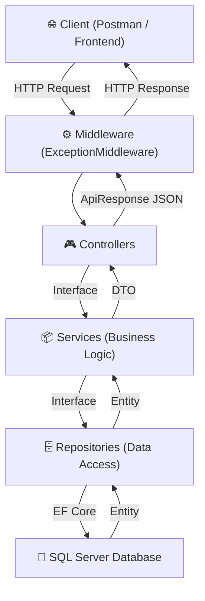
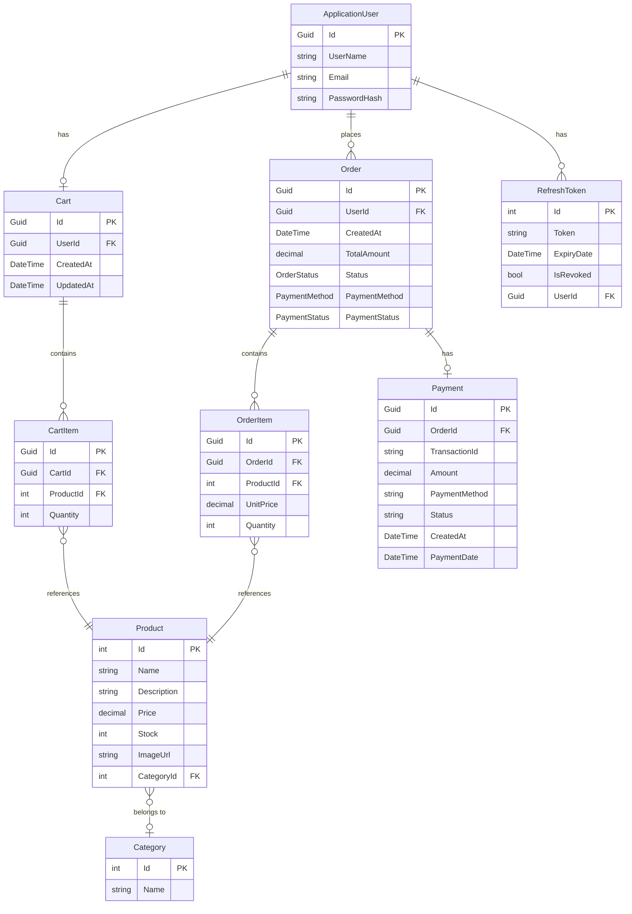
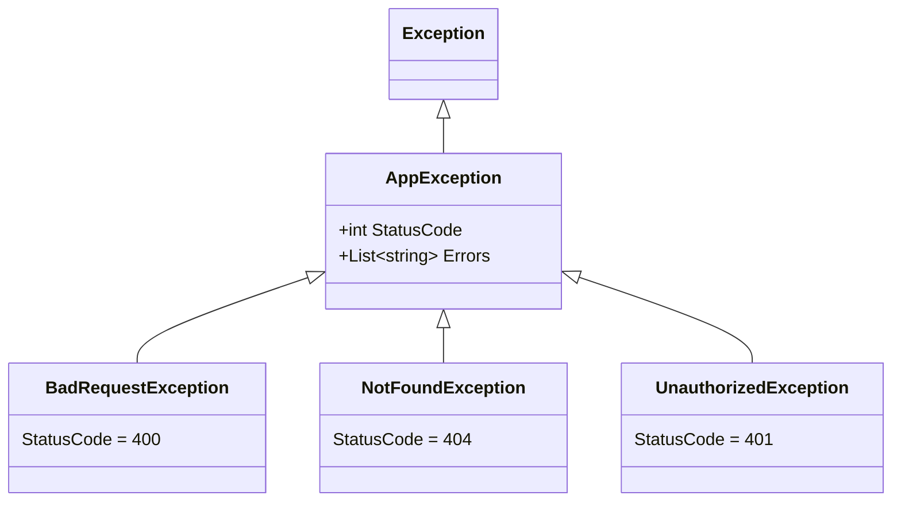
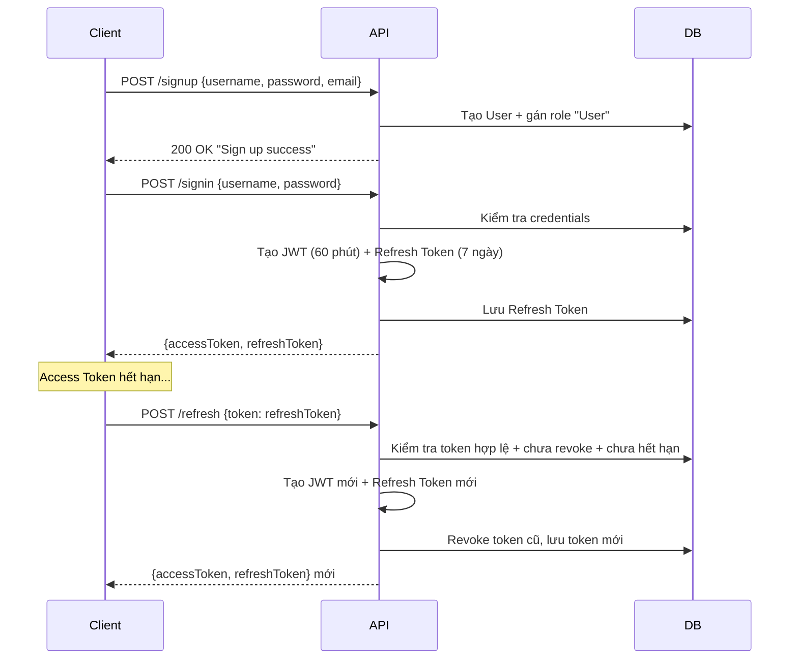
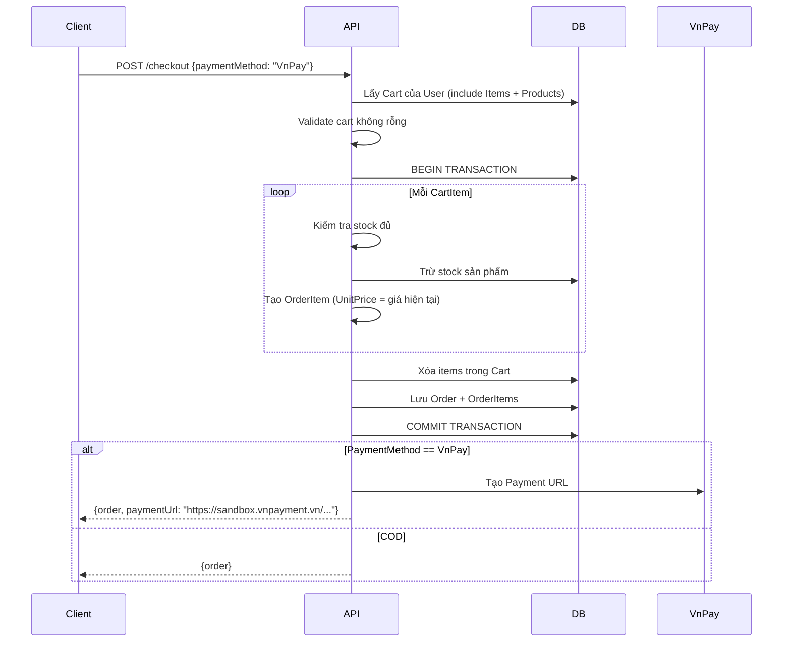

# 📖 ShopNN — Tài liệu Dự án Chi Tiết (Phần 1)

> **ShopNN** là một RESTful API thương mại điện tử chuyên bán đồng hồ, được xây dựng trên nền tảng **ASP.NET Core 8.0** với kiến trúc **Clean Architecture**.

---

## 1. Tổng quan Dự án

| Thông tin | Chi tiết |
|---|---|
| **Tên dự án** | ShopNN (Shop Nguyen Nguyen) |
| **Loại ứng dụng** | RESTful Web API |
| **Lĩnh vực** | E-Commerce — Cửa hàng Đồng hồ |
| **Framework** | ASP.NET Core 8.0 |
| **Database** | SQL Server (via Entity Framework Core 8.0) |
| **Authentication** | JWT Bearer Token + Refresh Token |
| **Payment Gateway** | VnPay (Sandbox) |
| **Solution** | 2 projects: `ShopNN` (API) + `ShopNN.Tests` (Unit Tests) |

### Chức năng chính
- 🔐 Đăng ký / Đăng nhập / Refresh Token / Đăng xuất
- 👤 Xem thông tin cá nhân (Profile)
- 📦 Quản lý Sản phẩm (CRUD + Search/Filter/Sort/Pagination)
- 🏷️ Quản lý Danh mục (CRUD)
- 🛒 Giỏ hàng (Thêm/Sửa/Xóa/Xóa toàn bộ)
- 📋 Đơn hàng (Checkout từ giỏ hàng, xem đơn, quản lý trạng thái)
- 💳 Thanh toán VnPay (tạo URL thanh toán, xử lý callback)
- 🛡️ Phân quyền Admin / User

---

## 2. Công nghệ sử dụng (Tech Stack)

| Công nghệ | Phiên bản | Mục đích |
|---|---|---|
| .NET SDK | 8.0 | Runtime & SDK |
| ASP.NET Core | 8.0 | Web API Framework |
| Entity Framework Core | 8.0 | ORM — truy vấn database |
| SQL Server | — | Cơ sở dữ liệu quan hệ |
| ASP.NET Identity | 8.0 | Quản lý User, Role, Password |
| JWT Bearer | 8.0.26 | Xác thực bằng Access Token |
| AutoMapper | 12.0.0 | Ánh xạ Entity ↔ DTO |
| Serilog | 10.0.0 | Structured Logging |
| Swashbuckle | 8.0.0 | Swagger/OpenAPI documentation |
| xUnit + Moq | — | Unit Testing (project Tests) |

---

## 3. Kiến trúc Hệ thống

Dự án sử dụng kiến trúc **Layered Architecture** kết hợp **Repository Pattern** và **Service Pattern**:



### Luồng xử lý Request
1. **Client** gửi HTTP Request
2. **ExceptionMiddleware** bắt và xử lý exception toàn cục
3. **Controller** nhận request, validate `ModelState`, gọi Service
4. **Service** chứa business logic, gọi Repository, sử dụng AutoMapper
5. **Repository** thao tác CSDL qua Entity Framework Core
6. Response trả về qua `ApiResponse<T>` wrapper thống nhất

---

## 4. Cấu trúc Thư mục

```
ShopNN/                          ← Solution Root
├── ShopNN.sln
├── .github/workflows/           ← CI/CD (GitHub Actions)
├── ShopNN/                      ← Main API Project
│   ├── Program.cs               ← Entry point, DI configuration
│   ├── ShopNN.csproj            ← NuGet packages
│   ├── appsettings.json         ← Config (Serilog)
│   ├── appsettings.Development.json ← Config (DB, JWT, VnPay)
│   ├── Controllers/             ← API Controllers (6 files)
│   │   ├── AccountController    ← Auth endpoints
│   │   ├── CartController       ← Cart CRUD
│   │   ├── CategoryController   ← Category CRUD
│   │   ├── OrderController      ← Order management
│   │   ├── PaymentController    ← VnPay callback
│   │   └── ProductController    ← Product CRUD + Search
│   ├── DTOs/                    ← Data Transfer Objects (17 files)
│   ├── Entities/                ← EF Core Entities (11 files)
│   │   └── ApplicationDbContext ← DbContext
│   ├── Data/
│   │   ├── SeedDataConstants    ← Seed data IDs
│   │   └── Configurations/      ← EF Fluent API configs (5 files)
│   ├── Mappings/
│   │   └── MappingProfile       ← AutoMapper profile
│   ├── Middlewares/
│   │   └── ExceptionMiddleware  ← Global error handler
│   ├── Repositories/
│   │   ├── Interface/           ← Repository contracts (7 files)
│   │   └── Implement/           ← Repository implementations (7 files)
│   ├── Services/
│   │   ├── Interface/           ← Service contracts (7 files)
│   │   └── Implement/           ← Service implementations (7 files)
│   ├── Shared/
│   │   ├── Enums/               ← OrderStatus, PaymentMethod, etc.
│   │   ├── Exceptions/          ← Custom exceptions
│   │   ├── Helper/              ← VnPayHelper, HashUtils
│   │   └── Wrappers/            ← ApiResponse<T>, PagedResult<T>
│   └── Utils/
│       └── HashUtils            ← HMAC-SHA512
├── ShopNN.Tests/                ← Unit Test Project
│   └── UnitTest/Services/       ← 7 test files cho 7 services
```

---

## 5. Database Entities & Relationships

### 5.1 Entity Relationship Diagram



### 5.2 Chi tiết từng Entity

#### `ApplicationUser` (kế thừa `IdentityUser<Guid>`)
Quản lý thông tin người dùng, tích hợp ASP.NET Identity.

| Property | Type | Mô tả |
|---|---|---|
| `Id` | `Guid` | Khóa chính (từ Identity) |
| `UserName` | `string` | Tên đăng nhập |
| `Email` | `string` | Email (unique) |
| `Orders` | `List<Order>` | Danh sách đơn hàng |
| `Cart` | `Cart?` | Giỏ hàng (1-1) |

#### `Product`
Thông tin sản phẩm đồng hồ.

| Property | Type | Mô tả |
|---|---|---|
| `Id` | `int` | Khóa chính, auto-increment |
| `Name` | `string` | Tên sản phẩm (required) |
| `Description` | `string` | Mô tả chi tiết (required) |
| `Price` | `decimal(18,2)` | Giá bán |
| `Stock` | `int` | Số lượng tồn kho |
| `ImageUrl` | `string?` | URL hình ảnh |
| `CategoryId` | `int?` | FK → Category |

#### `Category`
Danh mục sản phẩm.

| Property | Type | Mô tả |
|---|---|---|
| `Id` | `int` | Khóa chính |
| `Name` | `string` | Tên danh mục |
| `Products` | `List<Product>` | Sản phẩm thuộc danh mục |

#### `Cart` & `CartItem`
Giỏ hàng — mỗi User có tối đa 1 Cart.

| Cart Property | Type | Mô tả |
|---|---|---|
| `Id` | `Guid` | Khóa chính |
| `UserId` | `Guid` | FK → User |
| `CreatedAt` | `DateTime` | Thời điểm tạo |
| `UpdatedAt` | `DateTime` | Cập nhật lần cuối |
| `Items` | `List<CartItem>` | Các sản phẩm trong giỏ |

| CartItem Property | Type | Mô tả |
|---|---|---|
| `Id` | `Guid` | Khóa chính |
| `CartId` | `Guid` | FK → Cart |
| `ProductId` | `int` | FK → Product |
| `Quantity` | `int` | Số lượng |

#### `Order` & `OrderItem`
Đơn hàng — được tạo từ giỏ hàng khi checkout.

| Order Property | Type | Mô tả |
|---|---|---|
| `Id` | `Guid` | Khóa chính |
| `UserId` | `Guid` | FK → User |
| `CreatedAt` | `DateTime` | Thời điểm đặt hàng |
| `TotalAmount` | `decimal(18,2)` | Tổng tiền |
| `Status` | `OrderStatus` | Trạng thái đơn hàng |
| `PaymentMethod` | `PaymentMethod` | Phương thức thanh toán |
| `PaymentStatus` | `PaymentStatus` | Trạng thái thanh toán |

| OrderItem Property | Type | Mô tả |
|---|---|---|
| `Id` | `Guid` | Khóa chính |
| `OrderId` | `Guid` | FK → Order (Cascade) |
| `ProductId` | `int` | FK → Product (Restrict) |
| `UnitPrice` | `decimal(18,2)` | Giá tại thời điểm mua |
| `Quantity` | `int` | Số lượng |

#### `Payment`
Bản ghi thanh toán VnPay.

| Property | Type | Mô tả |
|---|---|---|
| `Id` | `Guid` | Khóa chính |
| `OrderId` | `Guid` | FK → Order |
| `TransactionId` | `string` | Mã giao dịch VnPay |
| `Amount` | `decimal(18,2)` | Số tiền |
| `Status` | `string` | "Pending" / "Success" / "Failed" |
| `PaymentDate` | `DateTime?` | Thời điểm thanh toán |

#### `RefreshToken`
Quản lý Refresh Token cho JWT rotation.

| Property | Type | Mô tả |
|---|---|---|
| `Id` | `int` | Khóa chính |
| `Token` | `string` | Giá trị token (GUID) |
| `ExpiryDate` | `DateTime` | Hết hạn (7 ngày) |
| `IsRevoked` | `bool` | Đã thu hồi? |
| `UserId` | `Guid` | FK → User |

---

## 6. Enums

```csharp
// Trạng thái đơn hàng
enum OrderStatus { Pending, Processing, Shipped, Delivered, Cancelled }

// Phương thức thanh toán
enum PaymentMethod { COD, VnPay }

// Trạng thái thanh toán
enum PaymentStatus { Unpaid, Paid, Failed, Refunded }

// Vai trò người dùng (string constants)
static class RoleNames { Admin = "Admin", User = "User" }
```

---

## 7. DTOs (Data Transfer Objects)

### 7.1 Account DTOs

| DTO | Mục đích | Properties |
|---|---|---|
| `SignUpDTO` | Đăng ký | `Username` (required), `Password` (required), `Email` (required, email format) |
| `SignInDTO` | Đăng nhập | `Username` (required), `Password` (required) |
| `TokenResponseDTO` | Trả token | `AccessToken`, `RefreshToken` |
| `RefreshTokenRequestDTO` | Refresh/Logout | `Token` |

### 7.2 Product DTOs

| DTO | Mục đích | Properties |
|---|---|---|
| `ProductRequestDTO` | Create/Update | `Name`, `Description`, `Price` (>0), `Stock` (≥0), `CategoryId?`, `ImageUrl?` |
| `ProductResponseDTO` | Response | `Id`, `Name`, `Description`, `Price`, `Stock`, `ImageUrl?`, `CategoryId?`, `CategoryName?` |
| `ProductQueryDTO` | Search/Filter | `Search?`, `CategoryId?`, `MinPrice?`, `MaxPrice?`, `InStock?`, `SortBy` (default: "name"), `SortOrder` (default: "asc"), `Page` (default: 1), `PageSize` (default: 10, max: 100) |

### 7.3 Category DTOs

| DTO | Mục đích | Properties |
|---|---|---|
| `CategoryRequestDTO` | Create/Update | `Name` (required, max 100 chars) |
| `CategoryResponseDTO` | Response | `Id`, `Name` |

### 7.4 Cart DTOs

| DTO | Mục đích | Properties |
|---|---|---|
| `CartItemRequestDTO` | Thêm vào giỏ | `ProductId` (required), `Quantity` (≥1) |
| `CartItemUpdateDTO` | Cập nhật SL | `Quantity` (≥1) |
| `CartItemResponseDTO` | Response item | `Id`, `ProductId`, `ProductName`, `ProductPrice`, `ProductImageUrl?`, `Quantity` |
| `CartResponseDTO` | Response cart | `Id`, `UserId`, `Items` (list) |

### 7.5 Order DTOs

| DTO | Mục đích | Properties |
|---|---|---|
| `OrderCreateRequestDTO` | Checkout | `PaymentMethod` (required: COD hoặc VnPay) |
| `OrderResponseDTO` | Response | `Id`, `CreatedAt`, `TotalAmount`, `Status`, `PaymentMethod`, `PaymentStatus`, `PaymentUrl?` (chỉ khi VnPay), `Items` |
| `OrderItemResponseDTO` | Item detail | `ProductId`, `ProductName?`, `UnitPrice`, `Quantity` |
| `OrderQueryDTO` | Admin search | `Status?`, `PaymentStatus?`, `PaymentMethod?`, `FromDate?`, `ToDate?`, `SortBy`, `SortOrder`, `Page`, `PageSize` |

---

## 8. Shared Infrastructure

### 8.1 `ApiResponse<T>` — Response Wrapper

Tất cả API response đều wrapped trong format thống nhất:

```json
// Success
{
  "success": true,
  "message": "Products retrieved",
  "data": { ... },
  "errors": []
}

// Failure
{
  "success": false,
  "message": "Product not found",
  "data": null,
  "errors": ["Detail error 1", "Detail error 2"]
}
```

### 8.2 `PagedResult<T>` — Pagination Wrapper

```json
{
  "items": [ ... ],
  "page": 1,
  "pageSize": 10,
  "totalCount": 45,
  "totalPages": 5,
  "hasPreviousPage": false,
  "hasNextPage": true
}
```

### 8.3 Custom Exceptions



### 8.4 ExceptionMiddleware

Middleware bắt mọi exception và chuyển thành `ApiResponse`:
- `AppException` → trả đúng `StatusCode` tương ứng
- `Exception` khác → trả `500 Internal Server Error`
- Tất cả đều log qua Serilog

---
# 📖 ShopNN — Tài liệu Dự án Chi Tiết (Phần 2)

## 9. API Endpoints

### 9.1 Account (`/api/account`)

| Method | Endpoint | Auth | Mô tả |
|---|---|---|---|
| `POST` | `/signup` | ❌ | Đăng ký tài khoản mới |
| `POST` | `/signin` | ❌ | Đăng nhập, nhận JWT Token |
| `POST` | `/refresh` | ❌ | Làm mới Access Token |
| `POST` | `/SignOut` | ❌ | Đăng xuất (revoke refresh token) |
| `GET` | `/profile` | ✅ User | Xem thông tin cá nhân |

**Luồng Authentication:**


### 9.2 Product (`/api/products`)

| Method | Endpoint | Auth | Mô tả |
|---|---|---|---|
| `GET` | `/` | ❌ | Lấy tất cả sản phẩm |
| `GET` | `/search?...` | ❌ | Tìm kiếm + Filter + Sort + Pagination |
| `GET` | `/{id}` | ❌ | Lấy sản phẩm theo ID |
| `POST` | `/` | ✅ Admin | Tạo sản phẩm mới |
| `PUT` | `/{id}` | ✅ Admin | Cập nhật sản phẩm |
| `DELETE` | `/{id}` | ✅ Admin | Xóa sản phẩm |

**Search Query Parameters:**
```
GET /api/products/search?Search=rolex&CategoryId=1&MinPrice=100&MaxPrice=50000
    &InStock=true&SortBy=price&SortOrder=desc&Page=1&PageSize=10
```

| Param | Type | Default | Mô tả |
|---|---|---|---|
| `Search` | string | null | Tìm theo Name hoặc Description |
| `CategoryId` | int? | null | Lọc theo danh mục |
| `MinPrice` | decimal? | null | Giá tối thiểu |
| `MaxPrice` | decimal? | null | Giá tối đa |
| `InStock` | bool? | null | true=còn hàng, false=hết hàng |
| `SortBy` | string | "name" | Sắp xếp: name, price, stock, date |
| `SortOrder` | string | "asc" | Thứ tự: asc hoặc desc |
| `Page` | int | 1 | Trang hiện tại (≥1) |
| `PageSize` | int | 10 | Số item/trang (1-100) |

### 9.3 Category (`/api/category`)

| Method | Endpoint | Auth | Mô tả |
|---|---|---|---|
| `GET` | `/` | ❌ | Lấy tất cả danh mục |
| `GET` | `/{id}` | ❌ | Lấy danh mục theo ID |
| `POST` | `/` | ✅ Admin | Tạo danh mục |
| `PUT` | `/{id}` | ✅ Admin | Cập nhật danh mục |
| `DELETE` | `/{id}` | ✅ Admin | Xóa danh mục |

### 9.4 Cart (`/api/cart`) — Yêu cầu đăng nhập

| Method | Endpoint | Auth | Mô tả |
|---|---|---|---|
| `GET` | `/` | ✅ User | Xem giỏ hàng |
| `POST` | `/items` | ✅ User | Thêm sản phẩm vào giỏ |
| `PUT` | `/items/{itemId}` | ✅ User | Cập nhật số lượng |
| `DELETE` | `/items/{itemId}` | ✅ User | Xóa 1 item khỏi giỏ |
| `DELETE` | `/clear` | ✅ User | Xóa toàn bộ giỏ hàng |

### 9.5 Order (`/api/order`) — Yêu cầu đăng nhập

| Method | Endpoint | Auth | Mô tả |
|---|---|---|---|
| `POST` | `/checkout` | ✅ User | Tạo đơn hàng từ giỏ hàng |
| `GET` | `/my-orders` | ✅ User | Xem đơn hàng của tôi |
| `GET` | `/admin/all` | ✅ Admin | Xem tất cả đơn hàng |
| `GET` | `/admin/search?...` | ✅ Admin | Tìm kiếm đơn hàng (paged) |
| `PUT` | `/admin/{id}/status` | ✅ Admin | Cập nhật trạng thái đơn |

**Checkout Flow:**


### 9.6 Payment (`/api/payment`)

| Method | Endpoint | Auth | Mô tả |
|---|---|---|---|
| `GET` | `/vnpay-return` | ❌ | VnPay callback (redirect URL) |

**VnPay Return Flow:**
1. VnPay redirect về `/api/payment/vnpay-return?vnp_TxnRef=...&vnp_ResponseCode=00&vnp_SecureHash=...`
2. Validate chữ ký HMAC-SHA512
3. Nếu `vnp_ResponseCode == "00"`: Payment → Success, Order → Processing
4. Nếu khác: Payment → Failed

---

## 10. Service Layer — Business Logic

### 10.1 AccountService

| Method | Logic |
|---|---|
| `SignUp` | Tạo user → gán role "User" |
| `SignIn` | Tìm user by username → check password → generate token pair |
| `RefreshToken` | Delegate sang AuthService |
| `SignOut` | Revoke refresh token |
| `FindByUserId` | Tìm user theo ID |

### 10.2 AuthService

| Method | Logic |
|---|---|
| `GenerateAccessTokenAsync` | Tạo JWT với claims: Name, NameIdentifier, Roles. Hết hạn 60 phút |
| `SaveRefreshTokenAsync` | Lưu refresh token (GUID) vào DB. Hết hạn 7 ngày |
| `GenerateTokenAsync` | Tạo cả Access + Refresh Token |
| `RefreshToken` | Validate token cũ → tạo token mới → revoke token cũ (Token Rotation) |
| `Revoke` | Đánh dấu `IsRevoked = true` |

### 10.3 ProductService

| Method | Logic |
|---|---|
| `CreateAsync` | Map DTO → Entity → lưu DB → trả Response DTO |
| `GetAllAsync` | Lấy tất cả (include Category) |
| `GetPagedAsync` | Search/Filter/Sort/Pagination (delegate to Repository) |
| `GetByIdAsync` | Tìm theo ID, throw `NotFoundException` nếu không tìm thấy |
| `UpdateAsync` | Tìm entity → map DTO values → update |
| `DeleteAsync` | Xóa theo ID |

### 10.4 CartService

| Method | Logic |
|---|---|
| `GetCartByUserIdAsync` | Tìm cart theo User. Nếu chưa có → tự tạo cart mới |
| `AddItemToCartAsync` | Validate quantity > 0, check stock. Nếu product đã có trong cart → cộng dồn quantity |
| `UpdateItemQuantityAsync` | Validate quantity, check stock → cập nhật |
| `RemoveItemFromCartAsync` | Xóa 1 item khỏi cart |
| `ClearCartAsync` | Xóa tất cả items (throw nếu cart đã rỗng) |

### 10.5 OrderService

| Method | Logic |
|---|---|
| `CreateOrderAsync` | **Transaction**: Lấy cart → validate → tạo order + items → trừ stock → xóa cart items → commit |
| `GetMyOrdersAsync` | Lấy orders của user (include Items + Products) |
| `GetAllOrdersAsync` | Admin: lấy tất cả orders |
| `GetAllOrdersPagedAsync` | Admin: search/filter/sort/pagination |
| `UpdateStatusAsync` | Admin: cập nhật trạng thái đơn hàng |

### 10.6 PaymentService

| Method | Logic |
|---|---|
| `CreatePaymentUrl` | Tạo VnPay payment URL với: amount, order info, IP, return URL. Ký HMAC-SHA512 |
| `CreatePaymentUrlByOrderId` | Tìm order → gọi CreatePaymentUrl |
| `ProcessVnPayReturn` | Validate signature → cập nhật Payment record → cập nhật Order status |

---

## 11. Repository Layer

### 11.1 Generic Repository (`IRepository<T>`)

Base repository cung cấp CRUD operations chung:

```csharp
interface IRepository<T> {
    Task<T?> GetByIdAsync(object id);
    Task<IEnumerable<T>> GetAllAsync();
    Task<T> AddAsync(T data);
    Task UpdateAsync(T data);
    Task DeleteAsync(object id);
    Task<IEnumerable<T>> FindAsync(Expression<Func<T, bool>> predicate);
}
```

### 11.2 Specialized Repositories

| Repository | Extends | Thêm methods |
|---|---|---|
| `ProductRepository` | `GenericRepository<Product>` | `GetPagedAsync` (search/filter/sort/paging), override `GetAllAsync` & `GetByIdAsync` để Include Category |
| `CategoryRepository` | `GenericRepository<Category>` | Không có thêm |
| `CartRepository` | `GenericRepository<Cart>` | `GetCartByUserIdAsync`, `DeleteItemAsync`, `ClearCartAsync`, `GetItemAsync`, `SaveChangeAsync` |
| `OrderRepository` | `GenericRepository<Order>` | `GetByUserIdAsync`, `BeginTransactionAsync`, `GetPagedAsync`, `SaveChangesAsync` |
| `PaymentRepository` | `GenericRepository<Payment>` | `GetByOrderIdAsync`, `SaveChangesAsync` |
| `RefreshTokenRepository` | `GenericRepository<RefreshToken>` | `GetByTokenAsync`, `GetActiveByTokenAsync` (include User, check !revoked & !expired) |

---

## 12. Authentication & Authorization

### JWT Configuration
- **Algorithm**: HMAC-SHA256
- **Access Token TTL**: 60 phút
- **Refresh Token TTL**: 7 ngày
- **Claims**: `Name`, `NameIdentifier` (UserId), `Role` (multiple)
- **Validate**: Lifetime ✅, IssuerSigningKey ✅, Issuer ❌, Audience ❌

### Password Policy (Identity)
| Rule | Value |
|---|---|
| Yêu cầu chữ số | ✅ |
| Yêu cầu chữ thường | ✅ |
| Yêu cầu chữ hoa | ✅ |
| Yêu cầu ký tự đặc biệt | ✅ |
| Độ dài tối thiểu | 6 |
| Lockout sau N lần sai | 5 lần → khóa 5 phút |

### Phân quyền
- **Public**: Xem sản phẩm, danh mục, đăng ký, đăng nhập
- **User** (đăng nhập): Giỏ hàng, đặt hàng, xem đơn hàng, profile
- **Admin**: CRUD sản phẩm/danh mục, quản lý tất cả đơn hàng

---

## 13. VnPay Integration

| Config Key | Giá trị (Sandbox) |
|---|---|
| `TmnCode` | `KBAKDCNU` |
| `BaseUrl` | `https://sandbox.vnpayment.vn/paymentv2/vpcpay.html` |
| `Version` | `2.1.0` |
| `CurrCode` | `VND` |
| `ReturnUrl` | `http://localhost:5290/api/payment/vnpay-return` |

**Tham số gửi đi**: `vnp_Version`, `vnp_Command`, `vnp_TmnCode`, `vnp_Amount` (×100), `vnp_CreateDate`, `vnp_CurrCode`, `vnp_IpAddr`, `vnp_Locale`, `vnp_OrderInfo`, `vnp_OrderType`, `vnp_ReturnUrl`, `vnp_TxnRef` (OrderId)

**Chữ ký**: HMAC-SHA512 với `HashSecret`

---

## 14. Seed Data (Migration)

Dữ liệu được seed tự động qua EF Core Migrations:

### Roles
| Id | Name |
|---|---|
| `11111111-...` | Admin |
| `22222222-...` | User |

### Admin User
| Field | Value |
|---|---|
| Username | `admin` |
| Email | `admin@gmail.com` |
| Password | `Admin@123` |
| Role | Admin |

### Categories
| Id | Name |
|---|---|
| 1 | Luxury Watches |
| 2 | Sport Watches |
| 3 | Smart Watches |
| 4 | Classic Watches |

### Products (11 sản phẩm mẫu)
Bao gồm: Rolex Day-Date, Patek Philippe Nautilus, AP Royal Oak, Casio G-Shock, Seiko Prospex, Garmin Fenix, Apple Watch Ultra 2, Samsung Galaxy Watch 6, Longines Master, Tissot Le Locle, Hamilton Jazzmaster.

---

## 15. AutoMapper Profile

| Source → Destination | Ghi chú |
|---|---|
| `Product` → `ProductResponseDTO` | Map `Category.Name` → `CategoryName` |
| `ProductRequestDTO` → `Product` | Direct mapping |
| `Category` ↔ `CategoryResponseDTO/RequestDTO` | Direct mapping |
| `Cart` → `CartResponseDTO` | Include Items |
| `CartItem` → `CartItemResponseDTO` | Map `Product.Name/Price/ImageUrl` |
| `Order` → `OrderResponseDTO` | Enum → String cho Status, PaymentMethod, PaymentStatus |
| `OrderItem` → `OrderItemResponseDTO` | Map `Product.Name` |

---

## 16. Logging (Serilog)

- **Sinks**: Console + File (`Logs/log-{Date}.txt`)
- **Rolling**: Mỗi ngày 1 file, giữ tối đa 7 ngày
- **Level**: Information (default), Warning (Microsoft/System)
- **Enrichers**: LogContext, MachineName, ThreadId
- **Request Logging**: `UseSerilogRequestLogging()` — log mọi HTTP request

---

## 17. Unit Tests

Dự án có **7 file unit test** cho tất cả services, sử dụng **xUnit + Moq**:

| Test File | Service | Số lượng test (ước tính) |
|---|---|---|
| `AccountServiceTests.cs` | AccountService | ~8 tests |
| `AuthServiceTests.cs` | AuthService | ~8 tests |
| `CartServiceTests.cs` | CartService | ~10 tests |
| `CategoryServiceTests.cs` | CategoryService | ~5 tests |
| `OrderServiceTests.cs` | OrderService | ~12 tests |
| `PaymentServiceTests.cs` | PaymentService | ~9 tests |
| `ProductServiceTests.cs` | ProductService | ~12 tests |

**Naming Convention**: `Method_Condition_Expected` (ví dụ: `SignIn_ValidCredentials_ReturnsToken`)

---

## 18. Cách chạy Dự án

### Yêu cầu
- .NET 8.0 SDK
- SQL Server (LocalDB hoặc full)

### Các bước

```bash
# 1. Clone repository
git clone https://github.com/NguyenNguyen0210/ApiSoldWatch.git

# 2. Restore packages
dotnet restore

# 3. Apply migrations
cd ShopNN
dotnet ef database update

# 4. Chạy API
dotnet run

# 5. Mở Swagger UI
# http://localhost:5290/swagger
```

### Chạy Unit Tests
```bash
cd ShopNN.Tests
dotnet test
```

---

## 19. Cấu hình quan trọng

### `appsettings.Development.json`
```json
{
  "ConnectionStrings": {
    "DefaultConnection": "Server=.;Database=ShopNN;Trusted_Connection=True;TrustServerCertificate=True;"
  },
  "Jwt": {
    "Key": "<symmetric-key-256bit>"
  },
  "VnPay": {
    "TmnCode": "KBAKDCNU",
    "HashSecret": "<vnpay-hash-secret>",
    "BaseUrl": "https://sandbox.vnpayment.vn/paymentv2/vpcpay.html",
    "ReturnUrl": "http://localhost:5290/api/payment/vnpay-return"
  }
}
```

> ⚠️ **Lưu ý bảo mật**: Không commit `Jwt:Key` và `VnPay:HashSecret` lên public repository. Nên sử dụng User Secrets hoặc Environment Variables trong production.
